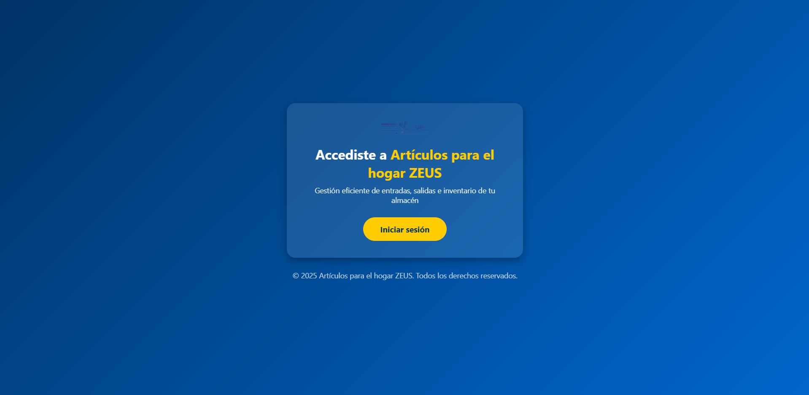
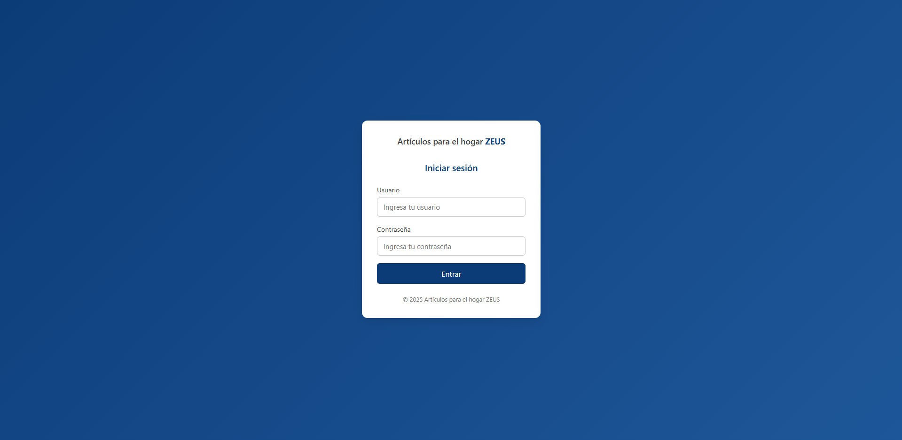
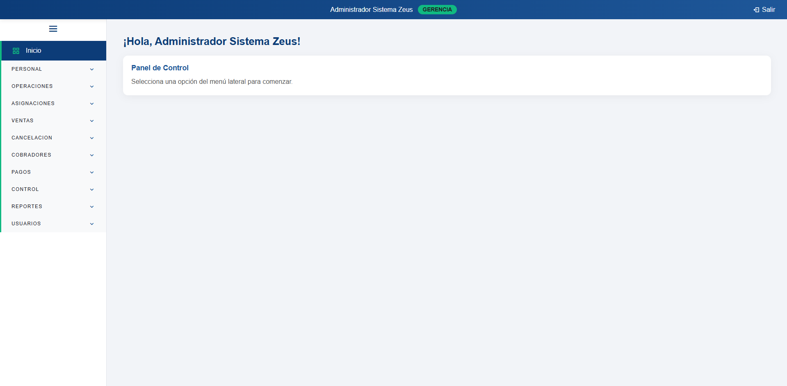
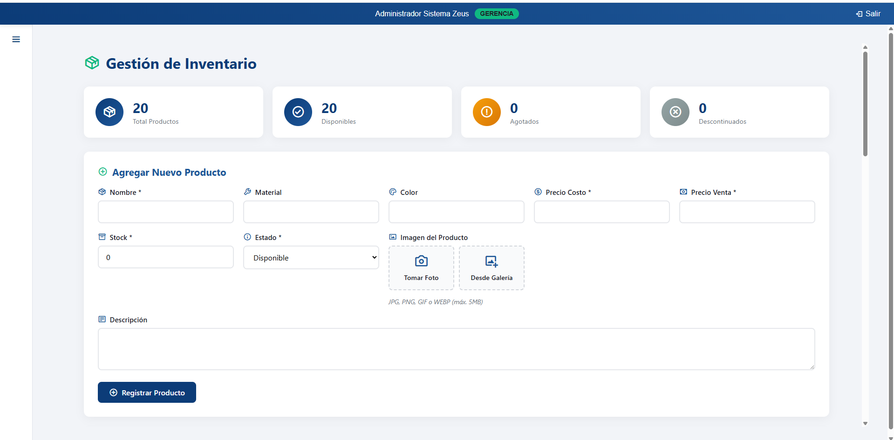
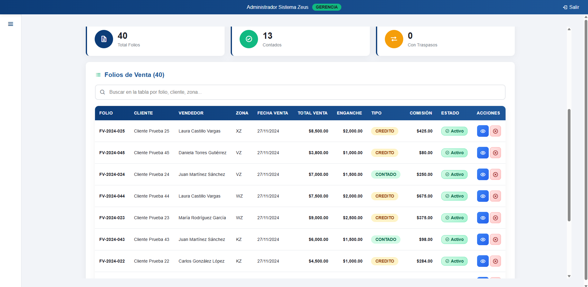
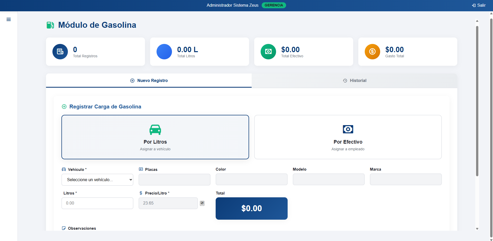
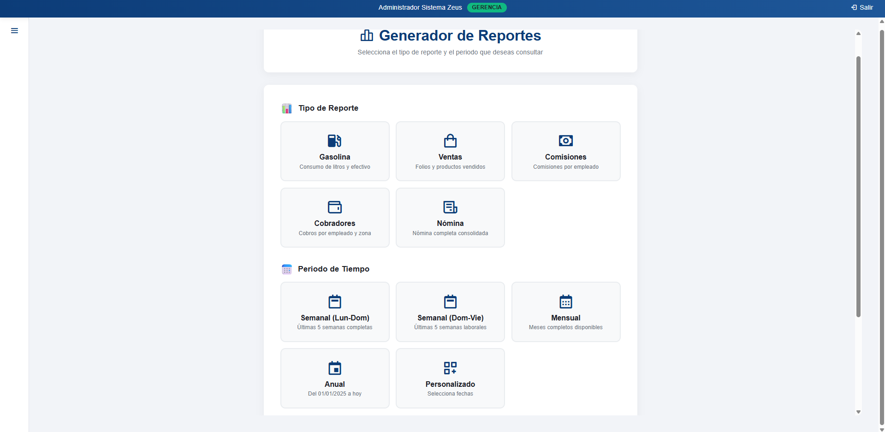

# Artículos para el hogar ZEUS - Sistema de Gestión de Inventario


## Descripción

Sistema web de gestión integral para **Artículos para el hogar ZEUS**, diseñado para administrar eficientemente el inventario, ventas, contratos, asignaciones de vehículos, control de gasolina, comisiones de cobradores y reportes financieros.

Este sistema permite llevar un control completo de las operaciones diarias de la empresa, desde la gestión de inventarios y vehículos hasta el seguimiento de pagos, comisiones y gastos operativos.

## Características principales

- **Gestión de Inventarios**: Control de entradas, salidas y stock de productos
- **Gestión de Vehículos**: Registro de placas, choferes y asignaciones
- **Sistema de Contratos**: Creación, seguimiento y cancelación de contratos de venta
- **Control de Gasolina**: Registro y seguimiento de consumo de combustible por vehículo
- **Gestión de Cobradores**: Control de cobros, comisiones y préstamos
- **Sistema de Pagos**: Registro de pagos, historial y control de fondos
- **Asignaciones**: Control de salidas y entradas de mercancía a vehículos
- **Reportes**: Generación de reportes de ventas, gasolina, nómina y comisiones
- **Gestión de Empleados**: Administración de personal
- **Dashboard Interactivo**: Panel de control con estadísticas en tiempo real
- **Sistema de Usuarios**: Control de acceso con diferentes niveles de permisos

## Tecnologías utilizadas

- **Backend**: PHP 7.4+
- **Base de datos**: SQLite
- **Frontend**: HTML5, CSS3, JavaScript
- **Frameworks/Librerías**:
  - Bootstrap (Interfaz responsive)
  - jQuery (Manipulación DOM y AJAX)
- **Servidor**: PHP Built-in Server / Apache

## Requisitos previos

- Windows 10/11
- PHP 7.4 o superior
- Extensión SQLite habilitada en PHP
- Navegador web moderno (Chrome, Firefox, Edge)

## Instalación

### Opción 1: Instalación automática (Recomendada)

1. Clona este repositorio:
```bash
git clone https://github.com/tu-usuario/GestorInventario.git
cd GestorInventario
```

2. Ejecuta el script de instalación de PHP:
```bash
1_instalar_php.bat
```

3. Inicia el servidor Zeus:
```bash
2_iniciar_zeus.bat
```

4. Accede al sistema:
```
http://localhost:8000
```

### Opción 2: Instalación manual

1. Descarga e instala PHP:
   - Descarga PHP desde [php.net](https://www.php.net/downloads)
   - Extrae el contenido en la carpeta `php/` del proyecto

2. Configura PHP:
   - Habilita la extensión SQLite en `php.ini`:
   ```ini
   extension=pdo_sqlite
   extension=sqlite3
   ```

3. Inicia el servidor PHP:
```bash
php -S localhost:8000
```

4. Importa la base de datos:
   - La base de datos SQLite se creará automáticamente en la primera ejecución
   - Si necesitas datos de prueba, ejecuta:
   ```bash
   sqlite3 sqlite/zeus.db < bd/sqlite.sql
   ```

## Scripts de utilidad

El proyecto incluye varios scripts batch para facilitar la administración:

| Script | Descripción |
|--------|-------------|
| `1_instalar_php.bat` | Instala y configura PHP automáticamente |
| `2_iniciar_zeus.bat` | Inicia el servidor web local |
| `Iniciar_Zeus_Minimizado.vbs` | Inicia el servidor en segundo plano |
| `Detener_Zeus.bat` | Detiene el servidor |
| `diagnostico.bat` | Verifica la configuración del sistema |
| `corregir_php.bat` | Repara problemas comunes de PHP |

## Estructura del proyecto

```
GestorInventario/
│
├── index.php                      # Página de bienvenida
├── bd/
│   ├── database.php               # Conexión a base de datos
│   └── sqlite.sql                 # Script SQL de inicialización
│
├── assets/                        # Recursos globales
│   ├── css/
│   ├── js/
│   └── images/
│
├── modules/                       # Módulos del sistema
│   ├── login/                     # Autenticación
│   ├── dashboard/                 # Panel principal
│   ├── vehiculos/                 # Gestión de vehículos
│   ├── inventarios/               # Control de inventario
│   ├── contratos/                 # Gestión de contratos
│   ├── contratosCancelados/       # Folios cancelados
│   ├── empleados/                 # Administración de empleados
│   ├── cobradores/                # Control de cobradores
│   ├── gasolina/                  # Registro de gasolina
│   ├── pagos/                     # Sistema de pagos
│   ├── asignaciones/              # Salidas/entradas de mercancía
│   ├── gastos/                    # Control de gastos
│   ├── reportes/                  # Generación de reportes
│   └── usuarios/                  # Gestión de usuarios
│
├── orm/                           # ORM personalizado
├── sqlite/                        # Base de datos SQLite
├── php/                           # Intérprete PHP portable
└── icon/                          # Iconos y favicons
```

## Usuarios por defecto

Al instalar el sistema, se crean los siguientes usuarios de prueba:

| Usuario | Contraseña | Rol | Descripción |
|---------|------------|-----|-------------|
| admin | admin123 | Administrador | Acceso completo al sistema |


**IMPORTANTE**: Cambia estas contraseñas en producción por motivos de seguridad.

## Capturas de pantalla

### Pantalla de inicio


### Login


### Dashboard principal


### Gestión de inventarios


### Módulo de contratos


### Control de gasolina


### Reportes



## Uso

### 1. Inicio de sesión
Accede a la aplicación e inicia sesión con tus credenciales.

### 2. Dashboard
El panel principal muestra un resumen de:
- Inventario actual
- Contratos activos
- Pagos pendientes
- Vehículos en ruta
- Estadísticas de la semana

### 3. Gestión de inventarios
- Agrega nuevos productos al inventario
- Registra entradas y salidas
- Consulta el stock disponible

### 4. Asignaciones de vehículos
- Registra salidas de mercancía a vehículos
- Controla el retorno de inventario
- Asigna choferes y cobradores

### 5. Contratos y ventas
- Crea nuevos contratos de venta
- Asigna productos vendidos
- Genera folios únicos
- Cancela contratos si es necesario

### 6. Control de gasolina
- Registra cargas de combustible
- Asocia gastos a vehículos específicos
- Genera reportes de consumo

### 7. Sistema de pagos
- Registra pagos de contratos
- Consulta historial de pagos
- Controla fondos disponibles

### 8. Contro de gastos
- Registra gastos de categorios
- Consulta historial de gastos
- Controla fondos 

### 9. Reportes
- Genera reportes de ventas por periodo
- Consulta comisiones de cobradores
- Analiza consumo de gasolina
- Reportes de nómina

## Configuración

### Base de datos
La configuración de la base de datos se encuentra en `bd/database.php`:

```php
$db_path = __DIR__ . '/../sqlite/inventarios.db';
$pdo = new PDO('sqlite:' . $db_path);
```

### Servidor PHP
Para cambiar el puerto del servidor, edita `2_iniciar_zeus.bat`:
```batch
php -S localhost:PUERTO_DESEADO
```


## Solución de problemas

### El servidor no inicia
- Verifica que PHP esté instalado correctamente: `php -v`
- Ejecuta `diagnostico.bat` para verificar la configuración
- Intenta `corregir_php.bat` para reparar problemas comunes

### Error de conexión a la base de datos
- Verifica que la carpeta `sqlite/` tenga permisos de escritura
- Asegúrate de que la extensión SQLite esté habilitada en PHP

### Pantalla en blanco después del login
- Verifica los permisos de las carpetas `modules/`
- Revisa el log de errores de PHP

## Licencia

Este proyecto está bajo la Licencia MIT. Consulta el archivo `LICENSE` para más detalles.

## Autor

**Adrián Laredo Reyes** - Full Stack


---

Desarrollado con dedicación para **Artículos para el hogar ZEUS** - © 2025
